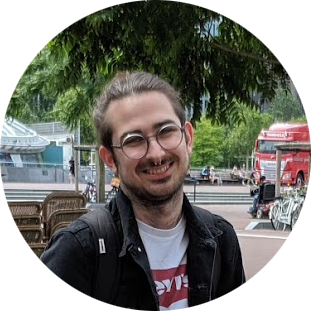

    

        

            
        

        

            <h1>Dr. Edward John Parkinson</h1>
            <h5>Senior Research Software Engineer (HPC)</h5>
            <h6>University of Southampton</h6>
        

    

 

I am a Senior Research Software Engineer within the [Southampton Research Software Group](https://rsgsoton.net/) (RSG) at the University of Southampton. My primary focus centres on creating sustainable and reproducible software solutions for researchers, with particular interests in Astrophysics and High Performance Computing (HPC). In my role in the RSG, I lead the development of interdisciplinary research software projects, collaborating primarily with researchers who use, or want to use, the super-computing facilities at the University of Southampton. In addition to software development, I am also involved in creating and delivering high-quality training materials, to teach essential software skills to both researchers and junior research software engineers.\\

Prior to my post in the RSG, I completed a PhD in Computational Astrophysics at the University of Southampton, under the supervision of [Professor Christian Knigge](https://www.phys.soton.ac.uk/people/ck7). My doctoral thesis and research focused on simulating the light emitted when a star is ripped apart by a supermassive black hole. In my studies, I belonged to the [Next Generation Computational Modelling Centre for Doctoral Training](https://www.ngcm.soton.ac.uk/) (NGCM), where I honed my skills in numerical modelling and modern programming practices, while also developing effective communication skills by attending and presenting at national and international workshops and conferences. The experiences of my PhD, coupled with training from the NGCM, equipped me with a robust set of competencies essential to bridge the gap between research and software engineering. 

My expertise revolves around the development of HPC applications for research, complemented by strong communication and interpersonal skills essential for interdisciplinary collaborations. During my doctoral studies, I developed a robust understanding of the \textit{C} programming language, along with proficiency in key technologies such as the Message Passing Interface (MPI), OpenMP, and CUDA. These skills were instrumental in accelerating and parallelising my research software and outputs. Since joining the RSG, my skill set has evolved significantly. I've deepened my understanding of the software engineering life cycle and acquired key competencies crucial for effective project management with interdisciplinary collaborations. This has not only broadened my technical knowledge, but also increased my ability to seamlessly transition between different projects and research fields, demonstrating adaptability and versatility in complex and dynamic environments.
